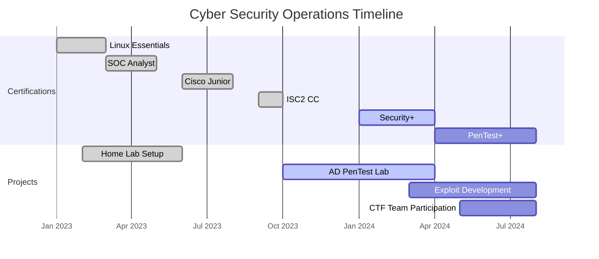

  
  

  
 
  
   
  
  
  
    
  
  
  

---

## 🔥 Threat Profile

> **Status:** ACTIVE | **Clearance:** CLASSIFIED | **Affiliation:** RED TEAM
> 
> **Current Operation:** B.S. Computer Engineering @ São Judas University
> **Specialization:** Offensive Security, DFIR, Network Penetration Testing
> **Mission:** Identify security gaps, exploit vulnerabilities, and strengthen digital defenses through ethical hacking methodologies.

  
  
  
  

---

## 🎓 **VALIDATED CREDENTIALS**

  
  <table>
    <tr>
      <td align="center">
        
         <small>Cybersecurity Operations</small>
      </td>
      <td align="center">
        
         <small>Linux Fundamentals</small>
      </td>
      <td align="center">
        
         <small>Network Security</small>
      </td>
    </tr>
    <tr>
      <td align="center">
        
         <small>Security Principles</small>
      </td>
      <td align="center">
        
         <small>In Progress</small>
      </td>
      <td align="center">
        
         <small>In Progress</small>
      </td>
    </tr>
  </table>

---

## ⚔️ Offensive Security Arsenal

  
  

### 🔴 Exploitation & Penetration Testing

  
  
  
  
  

### 🔴 Forensics & Incident Response

  
  
  
  

### 🔴 Infrastructure & Development

  
  
  
  

---
## 💻 Technical Skills Matrix

  

 

## 📊 **OPERATIONAL METRICS**

  
  
  <!-- Streak Stats -->
  
  
  <!-- Activity Graph -->
  

---

## 📊 Threat Intelligence Dashboard

| **Category** | **Tools & Technologies** | **Proficiency** |
|-------------|-------------------------|-----------------|
| **Reconnaissance** | Nmap, Shodan, Maltego, theHarvester | 🔴🔴🔴🔴⚪ |
| **Vulnerability Assessment** | Nessus, OpenVAS, Nikto | 🔴🔴🔴⚪⚪ |
| **Exploitation** | Metasploit, Burp Suite, SQLmap | 🔴🔴🔴🔴⚪ |
| **Post-Exploitation** | Mimikatz, PowerShell Empire, Cobalt Strike | 🔴🔴🔴⚪⚪ |
| **Forensics** | Wireshark, Autopsy, FTK Imager, Volatility | 🔴🔴🔴🔴⚪ |
| **Scripting** | Python, Bash, PowerShell | 🔴🔴🔴🔴⚪ |

---

 

<!-- Timeline de Projetos -->
## 📅 **OPERATION TIMELINE**

---

## 🌐 **CONNECT WITH OPERATIONS**

  
  <!-- Badges de Contato -->
  
  
  
  
  
    
  

## 🚀 Current Operations & Objectives

- **🎯 Active Mission:** Developing advanced penetration testing labs and exploit development research
- **📚 Research Focus:** Active Directory attack vectors, privilege escalation techniques, and APT simulations
- **🔬 Testing Environment:** Home lab with multiple VLANs, vulnerable VMs, and honeypots
- **🎓 Academic Focus:** Computer Engineering with emphasis on cybersecurity and network architecture

---

  
  
  
  
  
  
<em>"In cybersecurity, the only way to defend is to think like an attacker."</em>

  

