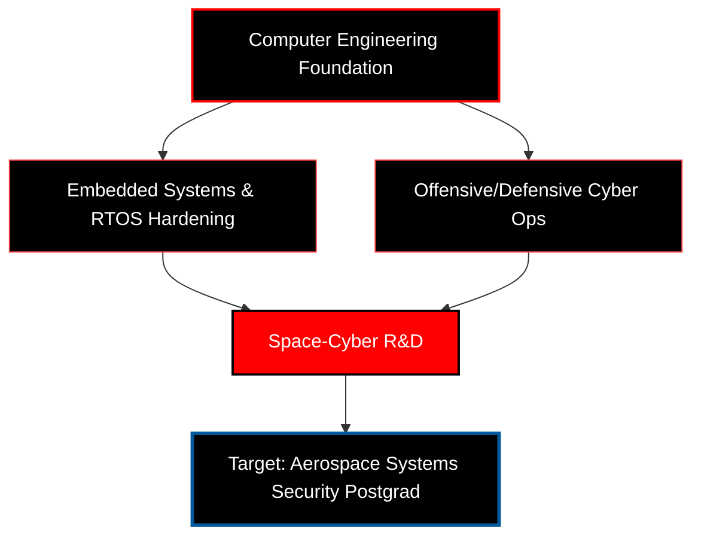

<div align="center">

<!-- CAPSULE HEADER -->


<!-- CYBER SECURITY TERMINAL GIF -->


<br><br>

<!-- TYPING SVG -->


</div>

---

## 🛠️ MISSION CONTROL DOSSIER

<div align="center">


</div>

```bash
$ whoami
> Leonardo Pereira Pinheiro (a.k.a Cyber Ghost)
> Computer Engineering Student @ São Judas University
> Goal: Postgraduation / Second Degree in Aerospace Engineering & Space Systems Security

$ system_diagnostics --profile
> Main Focus    : Hardening Critical Infrastructure & Securing Next-Gen Avionics/Satellites
> Path          : Blending Offensive Expertise (Red Team) with Defensive Cyber Forensics (DFIR)
> Philosophy    : "To safeguard orbital and ground assets, we must master the attacker's mindset."
```

---

## 💻 CERTIFICATIONS FLIGHT DECK

<div align="center">

| Specialty / Domain | Badge | Verified Scope |
| :--- | :---: | :--- |
| **Security Operations** |  | Threat Monitoring, Detection & SOC Incident Response |
| **Offensive Tactics** |  | Penetration Testing, Attack Vectors & Hacking Methodologies |
| **Defense & SOC** |  | Threat Intel, Vulnerability Analysis & Continuous Monitoring |
| **Infrastructure Dev** |  | Automated Configuration Management, Hardening & Orchestration |
| **Cloud & Containers** |  | Container Security, Orchestration Hardening & Microservices |
| **Fundamentals** |  | Core Cyber Security Principles, Governance & Risk Frameworks |

</div>

---

## ⚡ TECHNICAL SKILLS MATRIX

<div align="center">

### Core Scripting & Environments


<br><br>

| Flight Operations | Technologies & Frameworks | Mission Scope |
| :--- | :--- | :--- |
| **🔴 Red Team & Penetration Testing** | `Kali Linux` `Nmap` `Burp Suite` `Metasploit` `SQLmap` `Hydra` `OWASP Zap` | Exploit Development, Vulnerability Hacking, Web App Security, Attack Surface Mapping |
| **🔵 Blue Team & DFIR Operations** | `Wireshark` `Wazuh` `Snort` `Volatility` `Autopsy` `FTK Imager` `SIEM` | Digital Forensics, Memory Analysis, Network Traffic Decoupling, Malware Triage, Threat Hunting |
| **⚙️ Ground Control & Hardening** | `Docker` `Kubernetes` `Ansible` `Active Directory` `Linux Hardening` `Firewalls` | Automated Patching, VLAN Segmentation, AD Forest Hardening, Identity Access Management (IAM) |
| **🚀 Space-Cyber R&D Stack** | `Embedded C/C++` `RTL-SDR` `GNSS Spoofing` `Zephyr RTOS` `Avionics Protocols` | CubeSat Hardening, Firmware Reverse Engineering, Signal Analysis, Real-Time Systems Integrity |

</div>

---

## 🛰️ SPACE-CYBER R&D PATHWAY (AEROSPACE ROADMAP)

*Targeting the intersection of Computer Engineering and Space Systems to safeguard orbital communications, ground-stations, and avionics.*


```mermaid
graph TD
    A[Computer Engineering Foundation] --> B[Embedded Systems & RTOS Hardening]
    A --> C[Offensive/Defensive Cyber Ops]
    B --> D[Space-Cyber R&D]
    C --> D
    D --> E[Target: Aerospace Systems Security Postgrad]
    
    style A fill:#000,stroke:#FF0000,stroke-width:2px,color:#fff
    style B fill:#000,stroke:#FF4444,stroke-width:1px,color:#fff
    style C fill:#000,stroke:#FF4444,stroke-width:1px,color:#fff
    style D fill:#FF0000,stroke:#000,stroke-width:2px,color:#fff
    style E fill:#000,stroke:#00599C,stroke-width:3px,color:#fff
```

### 🎯 Research & Self-Study Milestones
* **📡 RF & Satellite Telemetry Hacking:** Analyzing satellite signal downlinks, decoding amateur radio packets, and exploring GNU Radio with **RTL-SDR**.
* **🛰️ Avionics & Embedded Protocols:** Reverse-engineering and securing communication interfaces like **CAN Bus**, **ARINC 429**, and **MIL-STD-1553**.
* **🌀 Real-Time OS (RTOS) Hardening:** Exploring micro-kernel security configurations under **Zephyr** and **FreeRTOS** for aerospace microcontrollers.
* **🔒 Space-Grade Communication Security:** Researching quantum-resistant lightweight cryptography for satellite ground-station uplinks.

---

## 🚀 FEATURED OPERATIONAL LABS

- **🔐 Linux Hardening & Audit:** Implementing CIS Benchmarks and custom Ansible playbooks to harden production Linux servers.
- **🌐 Network Security Lab:** Designing robust VLAN structures, PFSense rules, and intrusion detection alerts with Wazuh & Snort.
- **🏗 Active Directory Attack & Defend:** Deploying home labs mimicking enterprise networks to test Kerberoasting, Bloodhound path analysis, and AD GPO hardening.
- **🔎 Incident Response Playbooks:** Writing custom Python scripts to parse volatility memory dumps and dissect malicious PCAP artifacts.

---

## 📊 OPERATIONAL TELEMETRY

<div align="center">


<br><br>

<!-- CONTRIBUTION SNAKE ANIMATION -->
<picture>
  <source media="(prefers-color-scheme: dark)" srcset="https://raw.githubusercontent.com/Leobatman/Leobatman/output/github-contribution-grid-snake-dark.svg">
  
</picture>

<br><br>


</div>

---

## 🌐 CONNECT WITH MISSION CONTROL

<div align="center">

<a href="https://www.linkedin.com/in/leonardo-pereira-pinheiro/" target="_blank">
  
</a>
&nbsp;&nbsp;
<a href="https://tryhackme.com/p/Cyberghost7" target="_blank">
  
</a>
&nbsp;&nbsp;
<a href="https://app.hackthebox.com/users/2929177" target="_blank">
  
</a>

</div>

---

<div align="center">


<br>


<br><br>

> *"In cybersecurity, understanding the attack is essential to building effective defense. In aerospace, redundancy and hardening are key to survival."*

</div>
